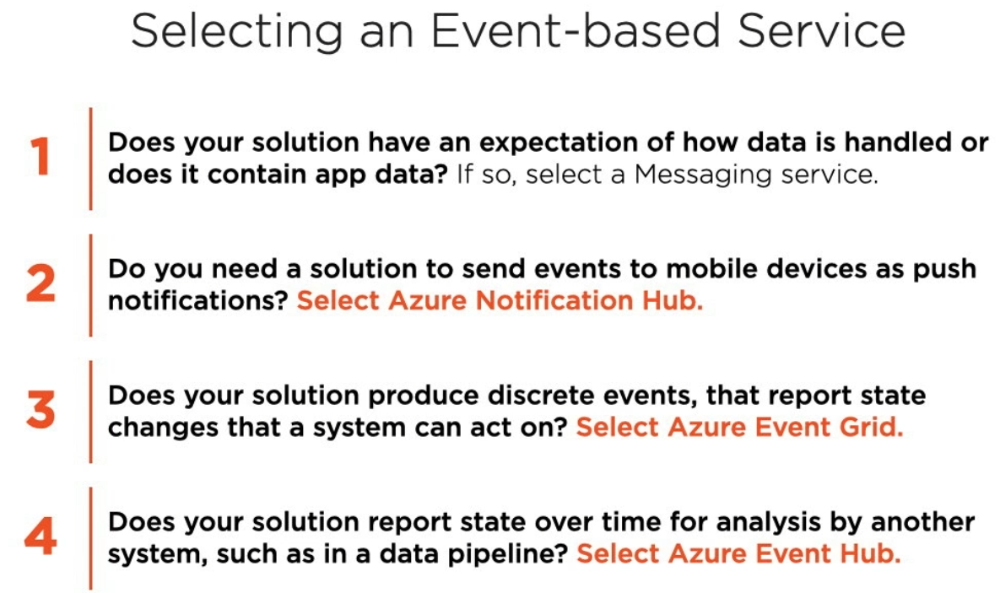
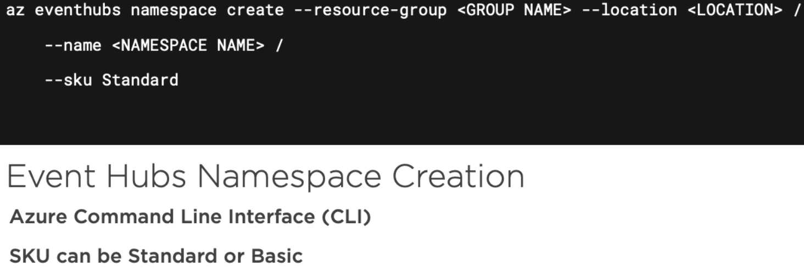
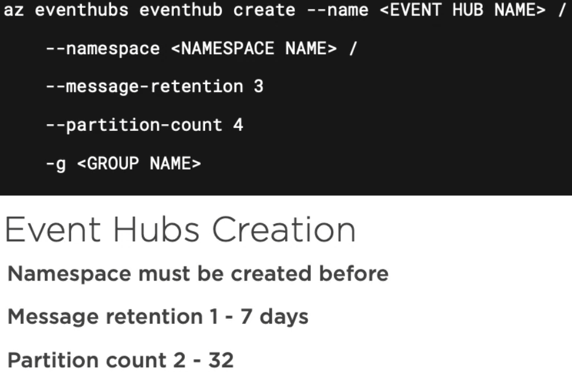
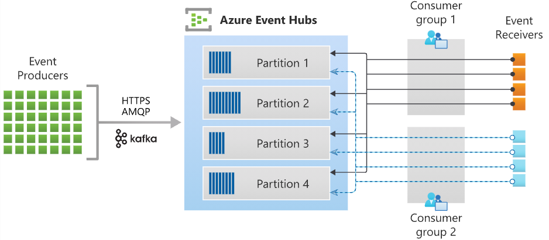

# Discover Azure Event Hubs
- Azure Event Hubs is a **big data** **streaming platform and event processing service**
- It can receive and process **millions of events per second**
- Data sent to an event hub can be transformed and stored by using any real-time analytics provider or batching/storage adapters
- Azure Event Hubs represents the "front door" for an event pipeline, often called an event ingestor in solution architectures
- Integration with Azure and non-Azure services

## Scenarios
- Telemetry (sensors) / IoT
- Dara archival
- Transaction processing
- Anomaly detection

| Feature                        | Description                                                                                                                                                                                                                                                                                   |
|:-------------------------------|:----------------------------------------------------------------------------------------------------------------------------------------------------------------------------------------------------------------------------------------------------------------------------------------------|
| Fully managed PaaS             | Event Hubs is a fully managed Platform-as-a-Service (PaaS) with little configuration or management overhead, so you focus on your business solutions. Event Hubs for Apache Kafka ecosystems gives you the PaaS Kafka experience without having to manage, configure, or run your clusters.   |
| Real-time and batch processing | Event Hubs uses a partitioned consumer model, enabling multiple applications to process the stream concurrently and letting you control the speed of processing.                                                                                                                              |
| Scalable                       | Scaling options, like Auto-inflate, scale the number of throughput units to meet your usage needs.                                                                                                                                                                                            |
| Rich ecosystem                 | Event Hubs for Apache Kafka ecosystems enables Apache Kafka (1.0 and later) clients and applications to talk to Event Hubs. You do not need to set up, configure, and manage your own Kafka clusters.                                                                                         |

Event Hubs contains the following key components:
- **Namespace** 
  - a container for one or more individual event hubs
  - all options applied to the namespace will be applied to all the contained event hubs
  - the throughput units are set at namespace level
- **Event Hub client**
  - the primary interface for developers interacting with the Event Hubs client library
  - There are several, different Event Hub clients, each dedicated to a specific use of Event Hubs, such as publishing or consuming events
- **Event Hub producer**
  - a type of client that serves as a source of telemetry data, diagnostics information, usage logs, or other log data, 
    as part of an embedded device solution, a mobile device application, a game title running on a console or other device,
    some client or server based business solution, or a web site
- **Event Hub consumer**
  - a type of client which reads information from the Event Hub and allows processing of it
  - Processing may involve aggregation, complex computation and filtering. 
  - Processing may also involve distribution or storage of the information in a raw or transformed fashion. 
  - Event Hub consumers are often robust and high-scale platform infrastructure parts with built-in analytics capabilities, 
    like Azure Stream Analytics, Apache Spark, or Apache Storm
- **Partition**
  - is an ordered sequence of events that is held in an Event Hub
  - Partitions are a means of data organization associated with the parallelism required by event consumers
  - Azure Event Hubs provides message streaming through a partitioned consumer pattern in which each consumer only reads 
    a specific subset, or partition, of the message stream
  - As newer events arrive, they are added to the end of this sequence
  - The number of partitions is specified at the time an Event Hub is created and cannot be changed
- **Consumer group**
  - is a particular view of an entire Event Hub
  - Consumer groups enable multiple consuming applications to each have a separate view of the event stream, 
    and to read the stream independently at their own pace and from their own position
  - There can be at most 5 concurrent readers on a partition per consumer group; however it is recommended that there 
    is only one active consumer for a given partition and consumer group pairing
  - Each active reader receives all of the events from its partition; if there are multiple readers on the same partition, 
    then they will receive duplicate events.
- **Event receivers**
  - Any entity that reads event data from an event hub
  - All Event Hubs consumers connect via the AMQP 1.0 session
  - The Event Hubs service delivers events through a session as they become available
  - All Kafka consumers connect via the Kafka protocol 1.0 and later
- **Throughput units (Standard Tier)** or **Processing units (Premium Tier)**
  

## Explore Event Hubs Capture
- Azure Event Hubs enables you to automatically capture the streaming data in Event Hubs in an Azure Blob storage or 
  Azure Data Lake Storage account of your choice
- Event Hubs Capture enables you to process real-time and batch-based pipelines on the same stream. This means you can
  build solutions that grow with your needs over time
- Event Hubs is a time-retention durable buffer for telemetry ingress, similar to a distributed log
- The key to scaling in Event Hubs is the partitioned consumer model. Each partition is an independent segment of data
  and is consumed independently. 
- Over time this data ages off, based on the configurable retention period. As a result, a given event hub never gets "too full."

## Scaling to **Throughput units** - Basic and Standard Tier
- Throughput units are pre-purchased and are **billed per hour**
- Standard Event Hubs can be configured with 1-20 throughput units, and you can purchase more with a quota increase support request
- Event Hubs traffic is controlled by **throughput units**. A single throughput unit allows:
  - **Ingress**
    - Up to 1 MB per second or 1000 events per second (whichever comes first)
    - beyond this capacity, ingress is throttled and a `ServerBusyException` is returned
  - **Egress**
    - Up to 2 MB per second or 4096 events per second
    - Egress does not produce throttling exceptions, but is still limited to the capacity of the purchased throughput units
- The **Auto-inflate** feature of Event Hubs automatically scales up by increasing the number of throughput units, to meet usage needs
- Event Hubs Capture copies data directly from the internal Event Hubs storage, bypassing throughput unit egress quotas 
  and saving your egress for other processing readers

## Scaling to **Processing units** - Premium and Dedicated Tier
- Event Hubs Premium provides superior performance and better isolation with in a managed multitenant PaaS environment
- The resources in a Premium tier are isolated at the CPU and memory level so that each tenant workload runs in isolation
- This resource container is called a Processing Unit(PU)
- You can purchase 1, 2, 4, 8 or 16 processing Units for each Event Hubs Premium namespace
- For example, Event Hubs Premium namespace with 1 PU and 1 event hub(100 partitions) can approximately offer core
  capacity of ~5-10 MB/s ingress and 10-20 MB/s egress for both AMQP or Kafka workloads

##  Scaling with Event Hubs - [more in the official documentation](https://docs.microsoft.com/en-us/azure/event-hubs/event-hubs-scalability)
### Event processor or consumer client
- in .NET or Java SDKs, you use an event processor client `EventProcessorClient`
- in Python and JavaScript SDKs, you use `EventHubConsumerClient`
- Event processor clients can work cooperatively within the context of a consumer group for a given event hub
- Clients will automatically manage distribution and balancing of work as instances become available or unavailable for the group

### Partition ownership tracking
- An event processor instance typically owns and processes events from one or more partitions
- Ownership of partitions is evenly distributed among all the active event processor instances associated with an event 
  hub and consumer group combination
- Each event processor is given a unique identifier and claims ownership of partitions by adding or updating an entry in a checkpoint store
- All event processor instances communicate with this store periodically to update its own processing state as well as to learn about other active instances.
  This data is then used to balance the load among the active processors

### Receive messages
- When you create an event processor, you specify the functions that will process events and errors
- Each call to the function that processes events delivers a single event from a specific partition
- If you want to make sure the consumer processes every message at least once, you need to write your own code with retry logic
- We recommend that you do things relatively fast. That is, do as little processing as possible. If you need to write to storage
  and do some routing, it's better to use two consumer groups and have two event processors

### Checkpointing
- Checkpointing is a process by which an event processor marks or commits the position of the last successfully processed event within a partition
- Marking a checkpoint is typically done within the function that processes the events and occurs on a per-partition basis within a consumer group
- If an event processor disconnects from a partition, another instance can resume processing the partition at the 
  checkpoint that was previously committed by the last processor of that partition in that consumer group
- When the processor connects, it passes the offset to the event hub to specify the location at which to start reading

## Control access to events
- Azure Event Hubs supports both Azure Active Directory and shared access signatures (SAS) to handle both authentication and authorization
- Built-in roles for authorizing access to Event Hubs data using Azure Active Directory and OAuth
  - **Azure Event Hubs Data Owner** - give complete access to Event Hubs resources
  - **Azure Event Hubs Data Sender** - give send access to Event Hubs resources
  - **Azure Event Hubs Data Receiver** - give receiving access to Event Hubs resources

### Authorize access with Managed identities
- To authorize a request to Event Hubs service from a managed identity in your application, you need to configure Azure 
  role-based access control settings for that managed identity
- Azure Event Hubs defines Azure roles that encompass permissions for sending and reading from Event Hubs
- when the Azure role is assigned to a managed identity, the managed identity is granted access to Event Hubs data at the appropriate scope

### Authorize access with Microsoft Identity Platform
- A key advantage of using Azure AD with Event Hubs is that your credentials no longer need to be stored in your code
- Instead, you can request an OAuth 2.0 access token from Microsoft identity platform
- Azure AD authenticates the security principal (a user, a group, or service principal) running the application
- If authentication succeeds, Azure AD returns the access token to the application, and the application can then use 
  the access token to authorize requests to Azure Event Hubs

### Authorize access to Event Hubs publishers with SAS
- An event publisher defines/is a virtual endpoint for an Event Hub
- The publisher can only be used to send messages to an event hub and not receive messages
- Typically, an event hub employs one publisher per client
- Each Event Hubs client is assigned a unique token which is uploaded to the client
- A client that holds a token can only send to one publisher, and no other publisher
- If multiple clients share the same token, then each of them shares the publisher
- All tokens are assigned with shared access signature keys
- Typically, all tokens are signed with the same key
- Clients operate on the same tokens until they expire

### Authorize access to Event Hubs consumers with SAS
- The clients must have either the **manage rights** or the **listen privileges** assigned to its Event Hubs namespace
  or event hub instance or topic
- data is consumed from Event Hubs using consumer groups
- the SAS policy scope is defined at consumer group level, not at the consumer level, so it's per consumer-group, not per single consumer/client

